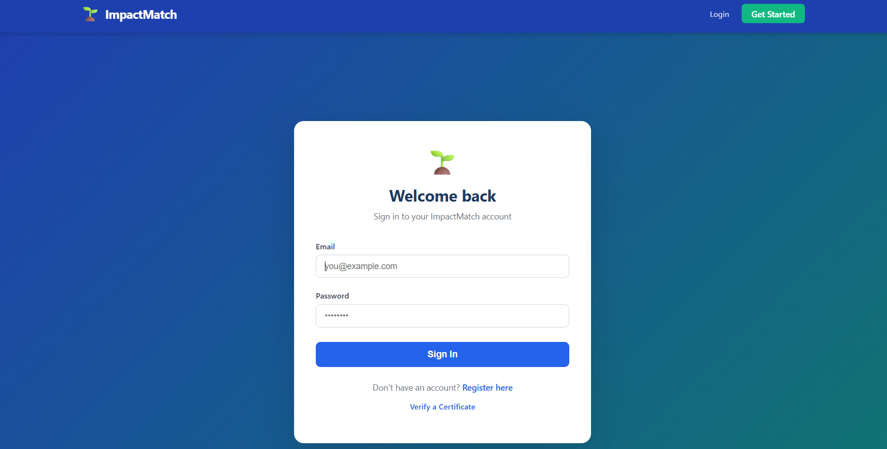
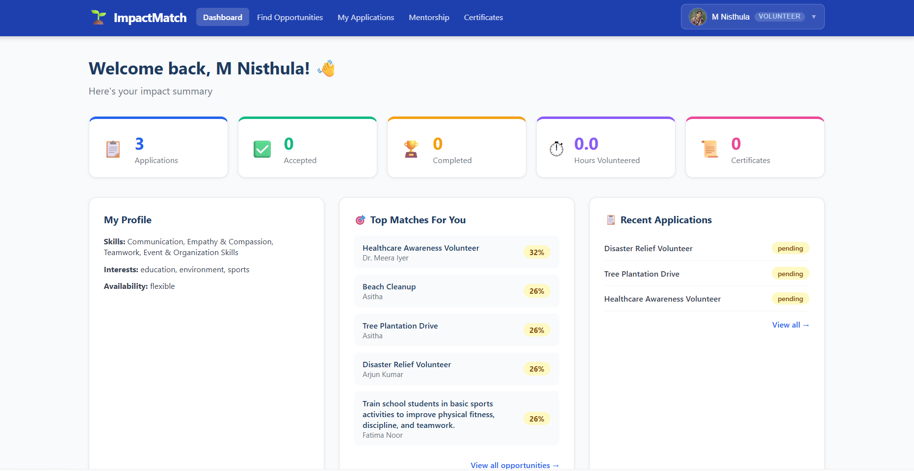
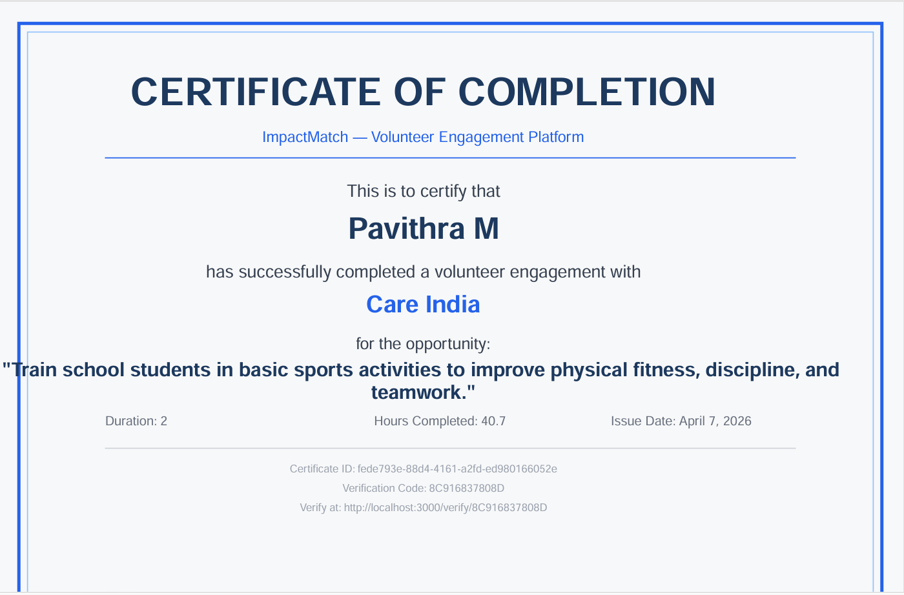

# 🌱 ImpactMatch

### AI-Powered Volunteer Engagement Platform

ImpactMatch is a MERN-stack platform that connects volunteers with NGOs using intelligent skill and interest matching, mentorship support, attendance tracking, and digital certificate generation.

---

## 🚀 Key Features

✅ Intelligent Volunteer Matching

✅ Role-Based Dashboards

✅ Opportunity Management

✅ Mentorship System

✅ Attendance Tracking

✅ Digital Certificate Generation

✅ JWT Authentication & Authorization

✅ Docker Deployment Support

---

## 📸 Screenshots

### Login Page



### Volunteer Dashboard



### Certificate Generation



---

## 🛠 Tech Stack

### Frontend
- React.js
- Context API
- Axios

### Backend
- Node.js
- Express.js

### Database
- MongoDB

### Authentication
- JWT
- bcrypt

### Deployment
- Docker

## 👩‍💻 My Contributions

- Developed role-based dashboard interfaces
- Implemented authentication and authorization
- Integrated volunteer matching workflows
- Built certificate generation and verification features
- Participated in database schema design
- Assisted in UI/UX implementation

## 📦 Project Structure

```
impactmatch/
├── backend/
│   ├── config/db.js                 # MongoDB connection
│   ├── controllers/                 # Route handlers (MVC)
│   │   ├── authController.js
│   │   ├── opportunityController.js
│   │   ├── applicationController.js
│   │   ├── attendanceController.js
│   │   ├── certificateController.js
│   │   ├── mentorshipController.js
│   │   └── matchingController.js
│   ├── middleware/
│   │   ├── auth.js                  # JWT protect + role authorize
│   │   └── validate.js              # express-validator rules
│   ├── models/
│   │   ├── User.js
│   │   ├── Opportunity.js
│   │   ├── Application.js
│   │   ├── Mentorship.js
│   │   ├── Attendance.js
│   │   └── Certificate.js
│   ├── routes/                      # Express route definitions
│   ├── services/
│   │   └── certificateService.js    # PDF generation
│   ├── utils/
│   │   ├── matchingAlgorithm.js     # Hybrid AI matching
│   │   ├── haversine.js             # GPS distance calculation
│   │   └── generateToken.js         # JWT creation
│   ├── scripts/seed.js              # Database seeding
│   ├── Dockerfile
│   ├── .env.example
│   └── server.js
│
├── frontend/
│   ├── public/index.html
│   ├── src/
│   │   ├── components/
│   │   │   ├── Navbar.js
│   │   │   ├── ProtectedRoute.js
│   │   │   └── OpportunityCard.js
│   │   ├── context/AuthContext.js   # Global auth state
│   │   ├── pages/
│   │   │   ├── Login.js
│   │   │   ├── Register.js
│   │   │   ├── Dashboard.js         # Role-aware router
│   │   │   ├── VolunteerDashboard.js
│   │   │   ├── OrganizationDashboard.js
│   │   │   ├── MentorDashboard.js
│   │   │   ├── Opportunities.js     # AI-ranked listing
│   │   │   ├── PostOpportunity.js
│   │   │   ├── Applications.js      # With GPS check-in
│   │   │   ├── Mentorship.js
│   │   │   ├── Certificates.js
│   │   │   └── VerifyCertificate.js # Public verification
│   │   ├── services/api.js          # Axios with interceptors
│   │   └── App.js
│   ├── Dockerfile
│   └── nginx.conf
│
└── docker-compose.yml
```

---

## 🚀 Quick Start (Local Development)

### Prerequisites
- Node.js 18+
- MongoDB 6+ (local or Atlas)
- npm or yarn

### 1. Clone and Install

```bash
git clone <your-repo>
cd impactmatch

# Install backend dependencies
cd backend
npm install

# Install frontend dependencies
cd ../frontend
npm install
```

### 2. Configure Environment

```bash
# Backend
cd backend
cp .env.example .env
# Edit .env with your values:
# - MONGO_URI: your MongoDB connection string
# - JWT_SECRET: a long random secret (min 32 chars)
# - CLIENT_URL: http://localhost:3000

# Frontend (optional — proxy is pre-configured)
cd ../frontend
cp .env.example .env
```

### 3. Seed Database (Optional)

```bash
cd backend
npm run seed
# Creates: org@impactmatch.com, volunteer@impactmatch.com, mentor@impactmatch.com
# All passwords: password123
```

### 4. Run the Application

```bash
# Terminal 1: Start backend
cd backend
npm run dev          # nodemon with hot reload

# Terminal 2: Start frontend
cd frontend
npm start            # React dev server on :3000
```

Visit: **http://localhost:3000**

---

## 🐳 Docker Deployment

```bash
# Build and start all services
JWT_SECRET=your_secret_here docker-compose up --build

# Stop
docker-compose down

# Stop and remove volumes
docker-compose down -v
```

Services:
- **Frontend**: http://localhost:3000 (nginx)
- **Backend API**: http://localhost:5000
- **MongoDB**: localhost:27017

---

## 🔑 API Reference

### Authentication

| Method | Endpoint | Access | Description |
|--------|----------|--------|-------------|
| POST | `/api/auth/register` | Public | Register new user |
| POST | `/api/auth/login` | Public | Login, returns JWT |
| GET | `/api/auth/me` | Private | Get current user |
| PUT | `/api/auth/profile` | Private | Update profile |

### Opportunities

| Method | Endpoint | Access | Description |
|--------|----------|--------|-------------|
| GET | `/api/opportunities` | Public | List all (paginated) |
| GET | `/api/opportunities/my` | Organization | My listings |
| GET | `/api/opportunities/:id` | Public | Single opportunity |
| POST | `/api/opportunities` | Organization | Create listing |
| PUT | `/api/opportunities/:id` | Organization | Update |
| DELETE | `/api/opportunities/:id` | Organization | Delete |

### AI Matching

| Method | Endpoint | Access | Description |
|--------|----------|--------|-------------|
| GET | `/api/matching/opportunities` | Volunteer | AI-ranked opportunities |
| GET | `/api/matching/score/:id` | Volunteer | Score for one opportunity |

### Applications

| Method | Endpoint | Access | Description |
|--------|----------|--------|-------------|
| POST | `/api/applications` | Volunteer | Apply to opportunity |
| GET | `/api/applications/my` | Volunteer | My applications |
| GET | `/api/applications/opportunity/:id` | Organization | Applicants |
| PUT | `/api/applications/:id/status` | Organization | Accept/Reject/Complete |

### Attendance

| Method | Endpoint | Access | Description |
|--------|----------|--------|-------------|
| POST | `/api/attendance/checkin` | Volunteer | GPS check-in |
| POST | `/api/attendance/checkout` | Volunteer | GPS check-out |
| GET | `/api/attendance/my` | Volunteer | My attendance history |

### Certificates

| Method | Endpoint | Access | Description |
|--------|----------|--------|-------------|
| POST | `/api/certificates/issue/:applicationId` | Organization | Issue certificate |
| GET | `/api/certificates/my` | Volunteer | My certificates |
| GET | `/api/certificates/verify/:code` | Public | Verify certificate |

### Mentorship

| Method | Endpoint | Access | Description |
|--------|----------|--------|-------------|
| GET | `/api/mentorship/mentors` | Authenticated | Available mentors |
| POST | `/api/mentorship/request` | Volunteer | Request a mentor |
| GET | `/api/mentorship/my` | Volunteer | My mentorships |
| GET | `/api/mentorship/requests` | Mentor | Requests received |
| PUT | `/api/mentorship/:id/respond` | Mentor | Accept/Reject |
| POST | `/api/mentorship/:id/session` | Mentor | Add session notes |
| PUT | `/api/mentorship/:id/complete` | Mentor | Approve completion |

---

## 🤖 AI Matching Algorithm

Located in `backend/utils/matchingAlgorithm.js`:

```
Final Score = (0.4 × interestMatch) + (0.3 × skillMatch) + (0.3 × semanticScore)
```

- **Interest Match**: Jaccard similarity between volunteer interests and opportunity categories
- **Skill Match**: Jaccard similarity between volunteer skills and required skills
- **Semantic Match**: Cosine similarity between embedding vectors (placeholder — replace `generateEmbedding()` with OpenAI embeddings or HuggingFace sentence-transformers for production)

Returns:
```json
{
  "matchScore": 0.72,
  "matchPercentage": 72,
  "matchedSkills": ["Python", "Teaching"],
  "skillGap": ["Leadership"],
  "categoryMatched": true,
  "semanticScore": 0.68,
  "breakdown": {
    "interestMatch": 0.80,
    "skillMatch": 0.67,
    "semanticScore": 0.68
  }
}
```

---

## 📍 GPS Attendance Verification

Check-in requires the volunteer to be within `CHECK_IN_RADIUS_METERS` (default: 200m) of the opportunity location.

The Haversine formula is used to compute great-circle distance. Remote opportunities skip location validation.

---

## 📜 Certificate Flow

1. Volunteer applies and gets accepted
2. Volunteer checks in and out via GPS
3. Organization marks application as "completed"
4. Organization issues certificate via `/api/certificates/issue/:applicationId`
5. System generates a PDF with unique `verificationCode`
6. Anyone can verify at `/verify/:code` (public endpoint)

---

## 🔒 Security Architecture

- **JWT**: HS256, configurable expiration, validated on every protected route
- **bcrypt**: Cost factor 12 for password hashing
- **Role-based middleware**: `authorize('volunteer', 'organization')` guards
- **Input validation**: express-validator on all mutation endpoints
- **CORS**: Restricted to `CLIENT_URL` in production
- **No secrets in code**: All sensitive values via environment variables
- **GPS anti-fraud**: Server-side radius validation (not client-trusting)
- **Certificate fraud prevention**: Unique IDs + org approval required

---

## 📈 Scalability Recommendations

### Database Indexes (already configured)
- `User.email` (unique)
- `Application.volunteerId + opportunityId` (compound unique)
- `Certificate.verificationCode` (unique)
- `Opportunity.category`, `organizationId`, geolocation

### Horizontal Scaling
- Backend is stateless (JWT) — run N replicas behind a load balancer
- Use MongoDB Atlas for managed horizontal scaling
- Add Redis for caching AI match scores (expensive computation)

### AI Matching in Production
```javascript
// Replace generateEmbedding() in matchingAlgorithm.js:
const { OpenAI } = require('openai');
const client = new OpenAI({ apiKey: process.env.OPENAI_API_KEY });

const generateEmbedding = async (text) => {
  const res = await client.embeddings.create({ model: 'text-embedding-3-small', input: text });
  return res.data[0].embedding;
};
```

### Production Checklist
- [ ] Set `NODE_ENV=production`
- [ ] Use a strong `JWT_SECRET` (32+ random chars)
- [ ] Enable MongoDB Atlas TLS
- [ ] Set `CLIENT_URL` to your actual domain
- [ ] Configure HTTPS (via nginx or cloud provider)
- [ ] Set up log aggregation (e.g., Winston + CloudWatch)
- [ ] Add rate limiting (express-rate-limit)
- [ ] Configure automated MongoDB backups
- [ ] Set up monitoring (PM2 or a cloud service)

---

## 🧪 Sample API Requests

### Register as Volunteer
```bash
curl -X POST http://localhost:5000/api/auth/register \
  -H "Content-Type: application/json" \
  -d '{
    "name": "Jane Smith",
    "email": "jane@example.com",
    "password": "securepass",
    "role": "volunteer",
    "skills": ["Python", "Teaching"],
    "interests": ["education", "technology"]
  }'
```

### Get AI-Ranked Opportunities
```bash
curl http://localhost:5000/api/matching/opportunities \
  -H "Authorization: Bearer <your_token>"
```

### Verify Certificate (Public)
```bash
curl http://localhost:5000/api/certificates/verify/ABCD1234EF56
```

---

## 🗓 Roadmap

- [ ] Real OpenAI/HuggingFace embeddings for semantic matching
- [ ] In-app messaging between volunteers and organizations
- [ ] Admin dashboard
- [ ] Email notifications (nodemailer/SendGrid)
- [ ] Mobile app (React Native)
- [ ] Blockchain certificate anchoring
- [ ] Impact analytics dashboard
